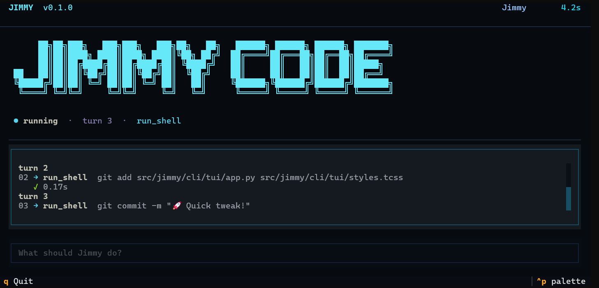

# 🕺 Jimmy Code🪩

<p align="center">
  
</p>

<p align="center">
  <strong>Jimmy Jimmy Ajaa 🎶</strong><br>
  Your terminal-native AI coding agent.
</p>


<p align="center">
  <code>task → think → code → test → ship</code>
</p>

<p align="center">
  <b>🍳 Give Jimmy a task. Let Jimmy cook.</b>
</p>

---

### 🧃 Jimmy in Action

<p align="center">
  
</p>

### 🥚 Jimmy Has Opinions

<details>
<summary>💀 Ask Jimmy a serious question</summary>

```text
$ jimmy "why am I single?"

Jimmy:

Because even your git history
has no meaningful commits. 💀
```

</details>

### 🫡 Jimmy's Fuel

```text
curiosity  +  caffeine  +  questionable confidence
```

<p align="center">
  <sub>Made for the terminal. Built with chaos. 👀</sub>
</p>
