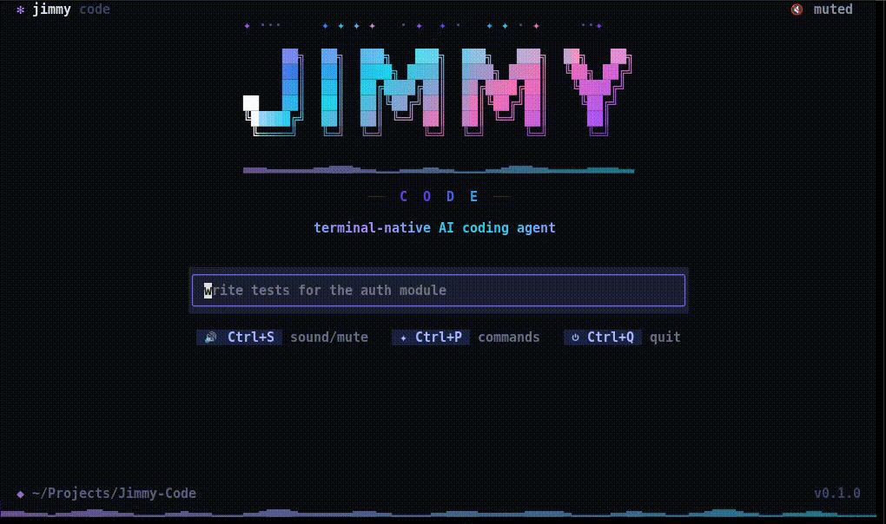

<div align="center">

# 🕺 Jimmy Code

### 🤖 Your AI coding buddy — right inside the terminal.



**Jimmy Jimmy Ajaa 🎶**

`task → think → code → test → ship`

🍳 **Give Jimmy a task. Let Jimmy cook.**

<br/>

[](https://www.python.org/)
[]()
[](https://textual.textualize.io/)
[](https://docs.litellm.ai/)
[](https://sqlite.org/)
[](LICENSE)

</div>

---

## 🧠 What is Jimmy?

**Jimmy Code is a terminal-native AI coding agent built with Python + Textual.**

Give it a task.

Jimmy can **read your code, search files, edit code, run commands, run tests, use Git, and keep going until the job is done.**

No browser.
No Electron.
No tab explosion. 😌

Just:

```text
You
 ↓
💭 Think
 ↓
🔧 Use tools
 ↓
👀 See results
 ↓
🛠️ Fix things
 ↓
🧪 Test
 ↓
✅ Done
```

---

## 🎬 Jimmy in Action

```text
❯ commit that all 4 with short fun emoji message

⠹ checking git status···  0.3s
✓ checking git status    8ms
✓ reading jimmy.tcss    90ms
✓ committing "styling widgets nicely 🍜"

I have committed all 4 files individually…

✦ 9.5s · 9.8k in · 393 out · 9 tools · 4 rounds
```

Jimmy doesn't dump a giant wall of logs at you.

It tells a **story of what it's doing**. 🕺

---

## ✨ What Jimmy Can Do

### 🤖 Think + Act

Jimmy runs a real agent loop:

```text
think → tool → observe → think → fix → test
```

Not just:

```text
prompt → code → good luck 💀
```

### 🧰 9 built-in tools

```text
📖 read_files
🔍 search_files
✏️ edit_files
📝 write_file
🩹 apply_patch
📂 list_files
💻 shell
🧪 run_tests
🌿 git
```

### 🛡️ You stay in control

Three permission modes:

| Mode               | Power                          |
| ------------------ | ------------------------------ |
| 🟢 **Ask**         | Ask before risky actions       |
| 🟡 **Auto**        | Safe actions run automatically |
| 🔴 **Full Access** | No approval prompts            |

Dangerous action?

Jimmy stops.

```text
🛡️ Approval required

Run:
git push origin main

✅ Allow
🔓 Allow session
❌ Deny
```

No sneaky permission escalation. 🚫

### 🗄️ Sessions that remember

Jimmy saves sessions locally with **SQLite + WAL**.

```text
~/.jimmy/sessions.db
```

So you can:

`stop → come back later → continue` ♻️

### 🤖 Bring your own brain

Powered by **LiteLLM**.

Pick your provider and model from Jimmy's UI.

```text
Ctrl + M
```

Models are saved here:

```text
~/.jimmy/models.json
```

### 🎨 A terminal that actually feels like an app

Jimmy comes with:

✨ interactive TUI
🛡️ approval screens
🤖 model picker
🗄️ session browser
⌘ command palette
🎨 themes
🔊 sound
⌨️ keyboard shortcuts
📋 copyable results

---

## 🚀 Install

### `uv` — recommended

```bash
git clone https://github.com/StarDust130/Jimmy-Code.git
cd Jimmy-Code
uv sync
```

### or `pip`

```bash
git clone https://github.com/StarDust130/Jimmy-Code.git
cd Jimmy-Code
pip install -e .
```

### Requirements

🐍 Python **3.12+**
💻 A terminal
🔑 API key for a supported model provider

---

## ⚡ Run Jimmy

Launch:

```bash
jimmy
```

Give it a task:

```bash
jimmy "fix the failing tests in src/"
```

That's it.

🍳 **Now let Jimmy cook.**

---

## ⌨️ Controls

| Key      | Action          |
| -------- | --------------- |
| `Enter`  | Send            |
| `Esc`    | Stop / Back     |
| `Ctrl+P` | Command palette |
| `Ctrl+M` | Model picker    |
| `Ctrl+O` | Sessions        |
| `Ctrl+N` | Home            |
| `Ctrl+C` | Copy last       |
| `Ctrl+A` | Copy all        |
| `Ctrl+L` | Clear line      |
| `Ctrl+S` | Sound           |
| `Ctrl+Q` | Quit            |
| `/`      | Commands        |

### 🍜 Slash commands

```text
/model
/permissions
/sessions
/new
/theme
/sound
/clear
/copy
/copyall
/help
/quit
```

---

## 🏗️ How Jimmy Works

```text
                🧑 You
                  │
                  ▼
            ┌────────────┐
            │ JimmyApp   │
            │ Textual UI │
            └─────┬──────┘
                  │
                  ▼
            ┌────────────┐
            │ Agent Loop │
            │ 💭 🔧 👀   │
            └─────┬──────┘
                  │
        ┌─────────┼─────────┐
        ▼         ▼         ▼
    🛡️ Policy   🔧 Tools   🤖 LLM
        │         │         │
        └─────────┼─────────┘
                  ▼
            🗄️ SQLite
```

Simple rule:

```text
UI ≠ Agent
Policy ≠ Tools
Tools ≠ Storage
```

Keep the pieces clean. Keep Jimmy fast. ⚡

---

## 📁 Project Structure

```text
src/
├── jimmy/
│   ├── agent/          # agent loop
│   ├── context/        # context management
│   ├── llm/            # providers + models
│   ├── permissions/    # safety + approvals
│   ├── sessions/       # SQLite persistence
│   ├── tools/          # tool registry
│   └── workspace/      # project scope
│
└── tui/
    ├── app.py          # JimmyApp
    ├── kit/            # theme + sound + helpers
    ├── screens/        # app screens
    └── widgets/        # UI components
```

---

## 🧪 Tests

Jimmy currently has **290+ tests**. ✅

Run them:

```bash
uv run pytest -q
```

Testing covers the agent loop, permissions, approval flows, SQLite migrations, session recovery, cleanup, and UI interactions.

---

## 🗺️ Roadmap

### ✅ Shipped

* [x] 🤖 Agent loop
* [x] 🧰 Coding tools
* [x] 🛡️ Permission system
* [x] 🗄️ Persistent sessions
* [x] 🏷️ Automatic session titles
* [x] 🔁 Model switching
* [x] 🎨 Terminal UI

### 🚧 Next

* [ ] 🧠 Long-term memory
* [ ] 🖼️ Image / file attachments
* [ ] 🧩 MCP plugins

---

## 🥚 Jimmy Has Opinions

<details>
<summary>😈 Ask Jimmy something stupid</summary>

```text
$ jimmy "why am I single?"

Because even your git history
has no meaningful commits. 💀
```

</details>

---

<div align="center">

# 🍳 Give Jimmy a task.

## Let Jimmy cook. 🕺

`task → think → code → test → ship`

**Built for the terminal. Powered by caffeine. ☕**

</div>
